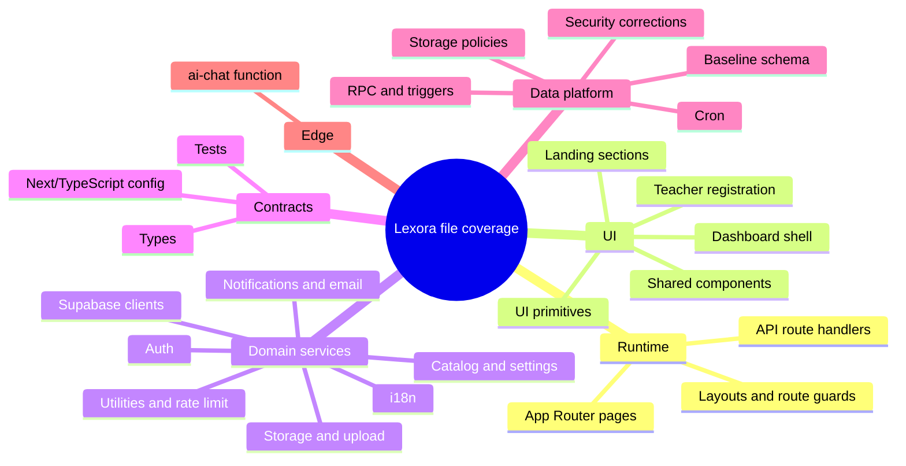

# Lexora Academy — File Coverage & Traceability Manifest

> Manifest ini melengkapi `CODEBASE-MINDMAP-WORKFLOW.md`. Tujuannya adalah memastikan seluruh file teks yang menjadi bagian dari aplikasi, test, konfigurasi, database, dan Edge Function tercatat satu per satu.
>
> **Tanggal audit:** 14 Agustus 2026  
> **Metode:** inventaris glob repository + pembacaan source/import/query/migration + cross-check route dan schema.

## 1. Scope dan Cara Membaca

- **Deep-read**: file yang memuat logic domain, route, query, RPC, guard, atau UI utama.
- **Inventory/config**: file dicatat dan diklasifikasikan, tetapi tidak memiliki logic domain yang besar.
- **Generated/static**: asset binary, SVG, favicon, audio, dependency `node_modules`, `.next`, dan file environment tidak diperlakukan sebagai modul aplikasi.
- Path di bawah ini menggunakan path repository dan **setiap path mewakili satu file**.
- `CODEBASE-MINDMAP-WORKFLOW.md` adalah dokumen arsitektur/workflow; manifest ini adalah checklist coverage.



## 2. Coverage Summary

| Kelompok | File tercatat | Fungsi utama |
|---|---:|---|
| Root/config/documentation | 14 | Konfigurasi project, lint, test, dokumentasi |
| App pages/layout/css | 83 | Public, auth, dashboard, redirect, loading, error |
| API route handlers | 19 | Auth, enrollment, placement, notification, email, AI |
| Components | 37 | Landing, layout, shared, registration, primitives |
| Libraries/services/i18n | 31 | Auth, Supabase, storage, notification, translation |
| Proxy | 1 | Session/role/rate-limit gate |
| Types/tests | 3 | Domain types dan test setup |
| Supabase config + Edge Function | 3 | Config dan AI function/Deno config |
| Supabase migrations | 41 | Schema, RLS, RPC, trigger, cron, corrective contract |
| **Total file teks terinventaris oleh glob** | **232** | Termasuk dua dokumen audit ini |
| Hidden repository files | 2 | `.gitignore` dan `supabase/.gitignore` |
| Static assets | 94 | PNG, ICO, SVG, dan audio placement |

> Jumlah glob dapat berubah jika file baru ditambahkan. Checklist di bawah adalah snapshot repository saat audit.

## 3. Root, Konfigurasi, Dokumentasi

| File | Peran |
|---|---|
| `AGENTS.md` | Aturan agent/Next.js project |
| `CLAUDE.md` | Instruksi/pedoman repository |
| `CODEBASE-MINDMAP-WORKFLOW.md` | Mind map, workflow, API/data/security map utama |
| `CODEBASE-FILE-COVERAGE.md` | Manifest coverage dan traceability per-file ini |
| `README.md` | Dokumentasi project bawaan |
| `eslint-now.json` | Snapshot/config hasil lint |
| `eslint.config.mjs` | Flat ESLint config dan pengecualian legacy |
| `next.config.ts` | Turbopack root, stale times, security headers |
| `package.json` | Dependency dan npm scripts |
| `postcss.config.mjs` | Integrasi PostCSS/Tailwind |
| `skills-lock.json` | Lock metadata skills |
| `tsconfig.json` | Strict TypeScript, alias `@/*`, Next plugin |
| `vercel-files.json` | Metadata file/deployment Vercel |
| `vitest.config.ts` | Konfigurasi Vitest dan jsdom |

## 4. Hidden Repository Files

File tersembunyi tidak masuk glob biasa, tetapi tetap relevan untuk repository:

| File | Peran |
|---|---|
| `.gitignore` | Ignore environment, Next/Vercel output, build artifacts |
| `supabase/.gitignore` | Ignore local Supabase generated state |

## 5. App Shell dan Public Pages

### 5.1 Shell, top-level redirect, dan state pages

| File | Peran |
|---|---|
| `src/app/layout.tsx` | Root metadata, cookie language, AuthProvider, LanguageProvider, a11y init |
| `src/app/globals.css` | Design tokens, theme, utility styling global |
| `src/app/page.tsx` | Landing composition dan static home content |
| `src/app/loading.tsx` | Global loading state |
| `src/app/not-found.tsx` | Global 404 page |
| `src/app/icon.png` | App icon |
| `src/app/favicon.ico` | Browser favicon |
| `src/proxy.ts` | Next.js 16 proxy: rate limit, session, role/status guard |
| `src/app/admin/page.tsx` | Redirect `/admin` ke `/admin/dashboard` |
| `src/app/student/page.tsx` | Redirect entry student ke dashboard |
| `src/app/teacher/page.tsx` | Redirect entry teacher ke dashboard |
| `src/app/program/page.tsx` | Legacy redirect `/program` ke `/project` |
| `src/app/berita/page.tsx` | Legacy redirect `/berita` ke `/event` |
| `src/app/(dashboard)/layout.tsx` | Dashboard shell, role detection, teacher status check, AI/notification popup |
| `src/app/(dashboard)/loading.tsx` | Dashboard loading state |
| `src/app/(dashboard)/error.tsx` | Dashboard error boundary |

### 5.2 Public route pages

| File | Peran |
|---|---|
| `src/app/project/page.tsx` | Marketplace course/program, filter, catalog, CTA enrollment |
| `src/app/guru/page.tsx` | Marketplace teacher, search/filter/pagination |
| `src/app/guru/[id]/page.tsx` | Detail teacher, program, bahasa, availability, schedule |
| `src/app/event/page.tsx` | Daftar event/news publik |
| `src/app/event/[slug]/page.tsx` | Detail event published dan registration link |
| `src/app/berita/[slug]/page.tsx` | Detail berita legacy/published |
| `src/app/alumni/page.tsx` | Daftar batch alumni |
| `src/app/alumni/[id]/page.tsx` | Detail batch alumni, badge, certificate |
| `src/app/faq/page.tsx` | FAQ dari `cms_content.section=faq` |
| `src/app/tentang/page.tsx` | About/mission/vision dan FAQ CMS |
| `src/app/kontak/page.tsx` | Contact info CMS dan form contact |
| `src/app/legal/syarat-ketentuan/page.tsx` | Terms & Conditions dari i18n |
| `src/app/legal/kebijakan-privasi/page.tsx` | Privacy Policy dari i18n |

### 5.3 Authentication pages

| File | Peran |
|---|---|
| `src/app/masuk/page.tsx` | Password login, Google OAuth, redirect role |
| `src/app/daftar/page.tsx` | Student signup, teacher wizard, settings flags, verification state |
| `src/app/lupa-password/page.tsx` | Request/reset password flow |
| `src/app/verifikasi-email/page.tsx` | Confirmation setelah email verification |

## 6. Student Pages

| File | Peran |
|---|---|
| `src/app/(dashboard)/student/loading.tsx` | Student route loading state |
| `src/app/(dashboard)/student/dashboard/page.tsx` | Aggregated course, grade, meeting, assignment, notification, placement, trial dashboard |
| `src/app/(dashboard)/student/kursus/page.tsx` | Enrollment aktif + discovery course |
| `src/app/(dashboard)/student/kursus/[id]/page.tsx` | Course detail dan akses tab content |
| `src/app/(dashboard)/student/kursus/[id]/materi/page.tsx` | Material list dan resource access |
| `src/app/(dashboard)/student/kursus/[id]/pertemuan/page.tsx` | Live session, join link, attendance |
| `src/app/(dashboard)/student/kursus/[id]/teman/page.tsx` | Batchmate/classmate list |
| `src/app/(dashboard)/student/kursus/[id]/teman/[userId]/page.tsx` | Classmate profile, badge, certificate preview |
| `src/app/(dashboard)/student/tugas/[id]/page.tsx` | Assignment detail, upload submission, resubmission, signed preview |
| `src/app/(dashboard)/student/kuis/[id]/page.tsx` | Quiz attempt, timer, answer, server score/review |
| `src/app/(dashboard)/student/courses/[id]/exam/page.tsx` | Final exam timer, objective/essay answer, submit/review |
| `src/app/(dashboard)/student/diskusi/page.tsx` | Discussion posts, replies, image upload, pin/lock |
| `src/app/(dashboard)/student/kalender/page.tsx` | Student calendar assignment/quiz/exam/session |
| `src/app/(dashboard)/student/nilai/page.tsx` | Grade and assessment aggregation |
| `src/app/(dashboard)/student/progress/page.tsx` | Material/quiz/session progress, skill and trend summary |
| `src/app/(dashboard)/student/pembayaran/page.tsx` | Invoice, payment proof upload, payment status |
| `src/app/(dashboard)/student/pengumuman/page.tsx` | Announcement list/read state |
| `src/app/(dashboard)/student/placement-test/page.tsx` | Placement purchase/access/test taking/scoring submission |
| `src/app/(dashboard)/student/placement/page.tsx` | Placement result/dashboard view |
| `src/app/(dashboard)/student/riwayat-placement/page.tsx` | Placement history, score percentage, level |
| `src/app/(dashboard)/student/sertifikat/page.tsx` | Certificate list, preview, generated printable certificate/download |
| `src/app/(dashboard)/student/profil/page.tsx` | Student profile, avatar, language, badge, password |

## 7. Teacher Pages

| File | Peran |
|---|---|
| `src/app/(dashboard)/teacher/loading.tsx` | Teacher route loading state |
| `src/app/(dashboard)/teacher/apply/page.tsx` | Existing teacher application, 5-step edit/revision/submit flow |
| `src/app/(dashboard)/teacher/dashboard/page.tsx` | Teacher KPI: classes, students, tasks, sessions, submissions |
| `src/app/(dashboard)/teacher/kelas/page.tsx` | Assigned course/batch list |
| `src/app/(dashboard)/teacher/kelas/[id]/page.tsx` | Class detail, students, learning overview |
| `src/app/(dashboard)/teacher/pertemuan/page.tsx` | Live session CRUD, weekly schedule, attendance marking |
| `src/app/(dashboard)/teacher/materi/page.tsx` | Material CRUD/upload per course |
| `src/app/(dashboard)/teacher/penugasan/page.tsx` | Assignment CRUD and submission overview |
| `src/app/(dashboard)/teacher/penugasan/[id]/grading/page.tsx` | Submission file preview, grade, feedback |
| `src/app/(dashboard)/teacher/quiz/page.tsx` | Quiz/final exam/question authoring and essay grading |
| `src/app/(dashboard)/teacher/nilai/page.tsx` | Student grade recap |
| `src/app/(dashboard)/teacher/kalender/page.tsx` | Teaching calendar |
| `src/app/(dashboard)/teacher/sertifikat/page.tsx` | Certificate upload/management |
| `src/app/(dashboard)/teacher/profil/page.tsx` | Teacher profile, languages, programs, availability, password |

## 8. Admin Pages

| File | Peran |
|---|---|
| `src/app/(dashboard)/admin/loading.tsx` | Admin route loading state |
| `src/app/(dashboard)/admin/dashboard/page.tsx` | Admin KPI and operational dashboard |
| `src/app/(dashboard)/admin/users/page.tsx` | User CRUD, role/status, admin-created account |
| `src/app/(dashboard)/admin/teacher-management/page.tsx` | Teacher applications, review, approval/rejection/revision |
| `src/app/(dashboard)/admin/program/page.tsx` | Program CRUD, tiers/tracks/details/grade weights |
| `src/app/(dashboard)/admin/kursus/page.tsx` | Course CRUD, teacher assignment, marketplace visibility |
| `src/app/(dashboard)/admin/batch/page.tsx` | Batch CRUD, capacity, teacher assignment, completion |
| `src/app/(dashboard)/admin/waiting-list/page.tsx` | Waiting list review/assignment |
| `src/app/(dashboard)/admin/verifikasi/page.tsx` | Payment proof review and approve/reject |
| `src/app/(dashboard)/admin/placement/page.tsx` | Placement test/question CRUD, question types and answer |
| `src/app/(dashboard)/admin/bahasa/page.tsx` | Language CRUD and active state |
| `src/app/(dashboard)/admin/jadwal/page.tsx` | Cross-course live schedule management |
| `src/app/(dashboard)/admin/event/page.tsx` | Event CRUD |
| `src/app/(dashboard)/admin/berita/page.tsx` | News/announcement/event/scholarship/competition CRUD |
| `src/app/(dashboard)/admin/cms/page.tsx` | Hero, FAQ, testimonial, partner, about/contact CMS CRUD |
| `src/app/(dashboard)/admin/laporan/page.tsx` | Report/statistics view |
| `src/app/(dashboard)/admin/audit/page.tsx` | Audit log search/filter/pagination/detail |
| `src/app/(dashboard)/admin/settings/page.tsx` | Auth, SMTP, AI, storage, notification, branding, payment, placement settings |

## 9. API Route Handlers

| File | Endpoint dan peran |
|---|---|
| `src/app/api/auth/login/route.ts` | `POST /api/auth/login`, server-side password login |
| `src/app/api/auth/register/route.ts` | `POST /api/auth/register`, registration helper dan role normalization |
| `src/app/api/auth/callback/route.ts` | `GET /api/auth/callback`, OAuth code exchange/profile redirect |
| `src/app/api/courses/route.ts` | `GET /api/courses`, marketplace catalog/filter/pagination |
| `src/app/api/enrollments/route.ts` | `GET/POST /api/enrollments`, enrollment RPC dan notification |
| `src/app/api/claim-trial/route.ts` | `POST /api/claim-trial`, claim trial serialized flow |
| `src/app/api/waiting-list/assign/route.ts` | `POST /api/waiting-list/assign`, admin assignment |
| `src/app/api/placement/route.ts` | `POST /api/placement`, placement submission/server scoring |
| `src/app/api/placement/purchase/route.ts` | `POST /api/placement/purchase`, invoice placement |
| `src/app/api/certificates/generate/route.ts` | `POST /api/certificates/generate`, eligibility/idempotency certificate |
| `src/app/api/notifications/route.ts` | `GET/PATCH /api/notifications`, list/mark read |
| `src/app/api/notifications/count/route.ts` | `GET /api/notifications/count`, unread count |
| `src/app/api/notifications/generate/route.ts` | `POST /api/notifications/generate`, reminder generation |
| `src/app/api/notifications/send/route.ts` | `POST /api/notifications/send`, internal API-key sender |
| `src/app/api/diskusi/route.ts` | `GET/POST /api/diskusi`, discussion endpoint |
| `src/app/api/email/send/route.ts` | `POST /api/email/send`, guarded SMTP email |
| `src/app/api/email/teacher-notification/route.ts` | `POST /api/email/teacher-notification`, signup notification to admin |
| `src/app/api/kontak/route.ts` | `POST /api/kontak`, contact message insertion |
| `src/app/api/ai/chat/route.ts` | `POST /api/ai/chat`, authenticated AI gateway |

## 10. Components

### 10.1 Landing

| File | Peran |
|---|---|
| `src/components/landing/hero.tsx` | Hero/CTA/testimonial visual |
| `src/components/landing/languages.tsx` | Supported language section |
| `src/components/landing/features.tsx` | Feature section |
| `src/components/landing/courses.tsx` | Course/catalog showcase |
| `src/components/landing/teachers.tsx` | Teacher showcase |
| `src/components/landing/news-events.tsx` | News/event showcase |
| `src/components/landing/testimonials.tsx` | Testimonial carousel/section |
| `src/components/landing/how-it-works.tsx` | Step-by-step onboarding section |
| `src/components/landing/special-offer-popup.tsx` | Special offer/placement CTA popup |

### 10.2 Layout

| File | Peran |
|---|---|
| `src/components/layout/navbar.tsx` | Public navigation, auth-aware links, language/accessibility |
| `src/components/layout/footer.tsx` | Public footer and legal links |
| `src/components/layout/sidebar.tsx` | Role-specific dashboard navigation |
| `src/components/layout/dashboard-layout.tsx` | Dashboard content shell wrapper |

### 10.3 Registration, shared, dan UI

| File | Peran |
|---|---|
| `src/components/register/teacher-wizard.tsx` | 11-step teacher signup wizard |
| `src/components/shared/accessibility-toggle.tsx` | Theme/font/spacing/dyslexia/reduced-motion controls |
| `src/components/shared/ai-chatbot.tsx` | AI chat client UI |
| `src/components/shared/badge-hexagon.tsx` | Student achievement badge visual |
| `src/components/shared/batch-countdown.tsx` | Batch start/countdown display |
| `src/components/shared/file-preview-modal.tsx` | Image/PDF/document preview |
| `src/components/shared/language-switcher.tsx` | Change i18n language/cookie |
| `src/components/shared/notification-bell.tsx` | Notification list/realtime/poll/read action |
| `src/components/shared/notification-toast.tsx` | Notification toast presentation |
| `src/components/shared/placement-prompt-popup.tsx` | Prompt student to take placement test |
| `src/components/shared/protected-route.tsx` | Legacy client-side route guard |
| `src/components/shared/screen-reader.tsx` | Screen-reader/accessibility helper |
| `src/components/shared/skip-to-content.tsx` | Skip navigation accessibility link |
| `src/components/shared/color-blind.css` | Color-blind accessibility overrides |
| `src/components/ui/badge.tsx` | Badge primitive |
| `src/components/ui/button.tsx` | Button primitive/variants/loading |
| `src/components/ui/card.tsx` | Card primitives |
| `src/components/ui/flag.tsx` | Flag/emoji display |
| `src/components/ui/image-upload.tsx` | Image upload abstraction |
| `src/components/ui/input.tsx` | Form input primitive |
| `src/components/ui/label.tsx` | Form label primitive |
| `src/components/ui/select.tsx` | Select primitive |
| `src/components/ui/tabs.tsx` | Tabs primitive |
| `src/components/ui/textarea.tsx` | Textarea primitive |

## 11. Libraries, Services, i18n, dan Types

### 11.1 Domain/service libraries

| File | Peran |
|---|---|
| `src/lib/auth.ts` | Signup/login/OAuth/password/profile/auth helpers dan teacher metadata |
| `src/lib/auth-context.tsx` | Auth React context, session/profile state, refresh |
| `src/lib/supabase-client.ts` | Browser Supabase client |
| `src/lib/supabase-server.ts` | SSR client dan service-role server client |
| `src/lib/rate-limit.ts` | In-memory IP/route rate limiter |
| `src/lib/notifications.ts` | Notification helper, template/recipient logic |
| `src/lib/notif-text.ts` | Render notification template ke text localized |
| `src/lib/email.ts` | SMTP/Nodemailer configuration dan send helper |
| `src/lib/settings.ts` | Load settings map dan feature flag conversion |
| `src/lib/storage.ts` | Public/signed storage URL helper |
| `src/lib/upload.ts` | File validation/upload helper |
| `src/lib/certificate.ts` | Certificate domain helper |
| `src/lib/course-catalog.ts` | Catalog tier/track/detail normalization |
| `src/lib/utils.ts` | Date, formatting, name, teacher filtering, meeting phase, cn helper |

### 11.2 Internationalization

| File | Peran |
|---|---|
| `src/lib/i18n/config.ts` | Language type, supported language, cookie/config |
| `src/lib/i18n/client.tsx` | Client LanguageProvider dan `useI18n` |
| `src/lib/i18n/server.ts` | Server translation helper |
| `src/lib/i18n/registry.ts` | Namespace registry/loader |
| `src/lib/i18n/translate.ts` | Translation key interpolation/lookup |
| `src/lib/i18n/namespaces/common.ts` | Common translations |
| `src/lib/i18n/namespaces/public.ts` | Public/auth/legal translations |
| `src/lib/i18n/namespaces/landing.ts` | Landing/public marketing translations |
| `src/lib/i18n/namespaces/student1.ts` | Student dashboard/learning translations set 1 |
| `src/lib/i18n/namespaces/student2.ts` | Student translations set 2 |
| `src/lib/i18n/namespaces/student3.ts` | Student translations set 3 |
| `src/lib/i18n/namespaces/teacher1.ts` | Teacher application translations |
| `src/lib/i18n/namespaces/teacher2.ts` | Teacher dashboard translations |
| `src/lib/i18n/namespaces/admin1.ts` | Admin translations set 1 |
| `src/lib/i18n/namespaces/admin2.ts` | Admin translations set 2 |
| `src/lib/i18n/namespaces/ui.ts` | UI translations |
| `src/lib/i18n/namespaces/ui2.ts` | UI translations set 2 |

### 11.3 Types dan test

| File | Peran |
|---|---|
| `src/types/index.ts` | User, teacher, course, enrollment, learning, grade, certificate, content, notification interfaces |
| `src/test/setup.ts` | Vitest/jsdom test setup |
| `src/test/rate-limit.test.ts` | Unit test rate limiter |

## 12. Supabase Edge Function

| File | Peran |
|---|---|
| `supabase/functions/ai-chat/index.ts` | Validasi token/internal secret, ambil profile/enrollment, panggil provider AI |
| `supabase/functions/ai-chat/deno.json` | Import map/compiler config Edge Function |
| `supabase/config.toml` | Supabase local/project configuration |
| `supabase/.gitignore` | Exclude Supabase local/generated files |

## 13. Supabase Migration Inventory

Urutan timestamp adalah urutan migration. Migration corrective terbaru mengubah/menegaskan contract migration sebelumnya.

| File | Area perubahan |
|---|---|
| `supabase/migrations/00000000000000_baseline_public_schema.sql` | Baseline public schema, tabel, function, RLS awal |
| `supabase/migrations/20260804040651_admin_insert_policies_for_waitlist_assign.sql` | Policy admin insert waiting list |
| `supabase/migrations/20260804041345_add_notif_read_admin_policy.sql` | Policy read notification admin |
| `supabase/migrations/20260804044115_enable_pg_cron.sql` | Enable pg_cron |
| `supabase/migrations/20260804044309_batch_lifecycle_columns_and_status_normalize.sql` | Lifecycle columns dan status batch |
| `supabase/migrations/20260804044325_create_course_schedules_table.sql` | `course_schedules` |
| `supabase/migrations/20260804044409_class_lifecycle_check_function_and_cron.sql` | Lifecycle check function + schedule |
| `supabase/migrations/20260804051826_create_notify_course_teachers_rpc.sql` | RPC notification teacher course |
| `supabase/migrations/20260804052147_backfill_batch_lifecycle_timestamps.sql` | Backfill timestamp lifecycle |
| `supabase/migrations/20260804070000_fix_certificate_status_and_rls.sql` | Certificate status/RLS correction |
| `supabase/migrations/20260804070100_create_announcements_table.sql` | `announcements` |
| `supabase/migrations/20260804070200_admin_complete_batch_rpc.sql` | RPC complete batch admin |
| `supabase/migrations/20260804070400_record_quiz_attempt_rpc.sql` | Server-side quiz attempt scoring |
| `supabase/migrations/20260804070500_complete_batch_calculate_grade.sql` | Complete batch + grade calculation |
| `supabase/migrations/20260804070600_seed_placement_data.sql` | Seed placement tests/questions |
| `supabase/migrations/20260804070700_attendance_teacher_policies.sql` | Attendance teacher policy |
| `supabase/migrations/20260805000000_batches_teacher_id.sql` | Teacher relation on batch |
| `supabase/migrations/20260805010000_attendance_read_admin.sql` | Attendance read admin policy |
| `supabase/migrations/20260805020000_certificates_backfill_code.sql` | Backfill certificate code |
| `supabase/migrations/20260805030000_placement_popup_settings.sql` | Placement popup settings |
| `supabase/migrations/20260805040000_payments_purpose.sql` | Payment purpose course/placement |
| `supabase/migrations/20260805060000_notify_admins_rpc.sql` | RPC notification admins |
| `supabase/migrations/20260805070000_batch_student_counts_trigger.sql` | Batch enrollment count trigger |
| `supabase/migrations/20260805080000_notify_batch_needs_teacher_trigger.sql` | Notify when batch needs teacher |
| `supabase/migrations/20260805090000_security_hardening.sql` | RLS, views, RPC security hardening |
| `supabase/migrations/20260806000000_secure_flow_corrections.sql` | Secure enrollment/payment/scoring corrections |
| `supabase/migrations/20260806010000_teacher_registration_verification.sql` | Teacher registration sync/application/approval |
| `supabase/migrations/20260806020000_add_turkish_chinese_languages.sql` | Add language seed Turkish/Chinese |
| `supabase/migrations/20260807000000_users_public_teacher_profiles.sql` | Public teacher profile contract |
| `supabase/migrations/20260808010000_catalog_tiers_tracks_and_details.sql` | Catalog tier/track/details |
| `supabase/migrations/20260808020000_normalize_program_track_type.sql` | Normalize program track |
| `supabase/migrations/20260808030000_notify_admin_new_batch.sql` | New batch admin notification |
| `supabase/migrations/20260808040000_batch_reminder_notifications.sql` | Batch reminder notifications |
| `supabase/migrations/20260808050000_batch_meetings_per_week.sql` | Batch meetings/week contract |
| `supabase/migrations/20260809000000_notification_i18n_templates.sql` | Notification template i18n |
| `supabase/migrations/20260809010000_fix_submissions_storage_policies.sql` | Submission storage policy |
| `supabase/migrations/20260809020000_submissions_created_at_and_guard_fix.sql` | Submission timestamp/guard fix |
| `supabase/migrations/20260811000000_corrective_contracts.sql` | Corrective authoritative contracts/RPC/RLS |
| `supabase/migrations/20260811010000_teacher_notification_delivery.sql` | Teacher notification delivery |
| `supabase/migrations/20260812000000_batchmate_profiles.sql` | Batchmate profile/certificate views |
| `supabase/migrations/20260812010000_placement_results_total_questions.sql` | Placement result total question count |

## 14. Static Asset Inventory

Asset tidak diimport sebagai modul TypeScript, tetapi tetap dipetakan karena dipakai oleh route/component.

| Lokasi/family | Isi |
|---|---|
| `logo.png` | Logo root legacy |
| `public/logo.png` | Logo public/auth |
| `public/kelasonline.png` | Asset visual landing/course |
| `public/dots.svg` | Background dots dashboard |
| `public/file.svg`, `public/globe.svg`, `public/next.svg`, `public/vercel.svg`, `public/window.svg` | Asset SVG bawaan/utility |
| `public/flags/cn.svg`, `de.svg`, `fr.svg`, `gb.svg`, `id.svg`, `ir.svg`, `jp.svg`, `kr.svg`, `sa.svg` | Flag SVG |
| `src/app/icon.png`, `src/app/favicon.ico` | Icon browser/app |
| `public/audio/placement/{ar,en,fa,id,ja,ko}/` | Audio listening placement untuk level A1, A2, B1, B2, C1, C2; masing-masing memiliki file listening `_1`, `_2`, dan pada level tertentu `_3` sesuai manifest filesystem |

## 15. Traceability: File → Domain → Data Boundary

```mermaid
flowchart LR
  PublicPages[src/app public pages] --> Landing[CMS/catalog/public read]
  AuthPages[src/app/masuk + daftar + lupa-password] --> Auth[src/lib/auth.ts]
  Auth --> AuthDB[(auth.users + users + teacher_applications)]
  Proxy[src/proxy.ts] --> RLS[(Supabase Auth + RLS)]
  StudentPages[student pages] --> BrowserClient[src/lib/supabase-client.ts]
  TeacherPages[teacher pages] --> BrowserClient
  AdminPages[admin pages] --> BrowserClient
  BrowserClient --> RLS
  API[src/app/api/*] --> ServerClient[src/lib/supabase-server.ts]
  ServerClient --> RPC[security RPC]
  RPC --> DB[(Postgres tables/views/triggers)]
  Learning[material/assignment/quiz/exam pages] --> Storage[src/lib/storage.ts + upload.ts]
  Storage --> Buckets[(Supabase Storage buckets)]
  Notification[bell/toast/pages] --> NotificationAPI[notification API/helper]
  NotificationAPI --> DB
  DB --> Realtime[Realtime notification]
  AI[ai-chatbot.tsx] --> AIAPI[/api/ai/chat]
  AIAPI --> Edge[supabase/functions/ai-chat]
  Edge --> Provider[External AI provider]
```

## 16. File-Level Findings

1. **Ada dua route entry legacy**: `src/app/program/page.tsx` dan `src/app/berita/page.tsx` hanya redirect; route canonical adalah `/project` dan `/event`.
2. **Ada dua implementasi teacher onboarding**: `src/app/daftar/page.tsx` + `teacher-wizard.tsx` untuk signup, sedangkan `teacher/apply/page.tsx` adalah application/edit/revision setelah account/session tersedia.
3. **Dashboard page banyak memakai browser Supabase client langsung**. API/RPC dipakai untuk boundary sensitif seperti enrollment, scoring, certificate, placement, email, dan AI.
4. **Discussion contract sudah konsisten pada tabel data**: `src/app/(dashboard)/student/diskusi/page.tsx`, `src/app/(dashboard)/student/kursus/[id]/page.tsx`, dan `src/app/api/diskusi/route.ts` menggunakan `discussion_posts`. Exact search menunjukkan `.from('discussions')` hanya berada pada `supabase.storage.from('discussions')` untuk upload gambar.
5. **`src/types/index.ts` tidak selalu menjadi schema generator**; beberapa page memakai interface lokal dan `any` untuk hasil nested Supabase. Perubahan schema harus dicek terhadap page, view, dan migration sekaligus.
6. **Asset placement audio dipakai sebagai data/content eksternal page**, bukan sebagai logic route; perubahan file audio tidak mengubah diagram runtime kecuali URL/path seed placement berubah.
7. **Satu-satunya test yang terinventaris adalah `src/test/rate-limit.test.ts`**; coverage workflow database dan page belum terlihat memiliki test otomatis.

## 17. Checklist Audit

- [x] Root config dan dokumentasi tercatat.
- [x] App shell, public, auth, legal, redirect, loading, error, icon tercatat.
- [x] Semua route student tercatat.
- [x] Semua route teacher tercatat.
- [x] Semua route admin tercatat.
- [x] Semua API route handler tercatat.
- [x] Semua component landing/layout/register/shared/ui tercatat.
- [x] Semua lib, i18n namespace, types, test tercatat.
- [x] Supabase config, Edge Function, dan seluruh migration tercatat.
- [x] Static asset family dicatat dan dihubungkan ke domain pemakai.
- [x] Mind map/workflow detail berada di `CODEBASE-MINDMAP-WORKFLOW.md`.

## 18. Batasan Audit

Manifest ini adalah audit repository statis. Ia tidak membuktikan bahwa environment production memiliki migration terbaru, bucket/policy yang sama, env var lengkap, SMTP aktif, provider AI aktif, atau data CMS tersedia. Untuk verifikasi runtime diperlukan `npm run build`, `npm test`, akses Supabase project, dan smoke test browser per role.
