# Lexora Academy — Codebase Mind Map & Workflow

> Analisis statis source code dan Supabase migrations repository.
> Dibuat: 14 Agustus 2026.
>
> Dokumen ini menjelaskan **implementasi aktual yang ditemukan di codebase**, bukan rancangan ideal.

---

## 1. Ringkasan Eksekutif

Lexora Academy adalah platform pembelajaran bahasa online dengan alur utama:

1. Pengunjung melihat katalog program/kursus dan profil guru.
2. Pengguna mendaftar sebagai student atau mendaftar sebagai calon teacher.
3. Supabase Auth membuat session dan profile `public.users`.
4. `src/proxy.ts` memeriksa session, role, status akun, dan status aplikasi teacher.
5. Student memilih kursus, masuk batch, lalu membayar jika kursus berbayar.
6. Admin memverifikasi pembayaran atau mengatur waiting list.
7. Student belajar melalui materi, pertemuan live, tugas, quiz, diskusi, dan final exam.
8. Nilai dihitung oleh database; kelulusan dapat menghasilkan sertifikat dan badge.
9. Notifikasi dikirim lewat database trigger/RPC, cron, API route, dan realtime subscription.
10. AI chatbot memakai Next.js API route sebagai gateway ke Supabase Edge Function dan provider AI eksternal.

---

## 2. Technology & Runtime Map

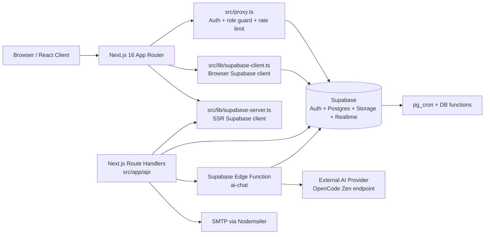

### Teknologi yang terdeteksi

| Area | Implementasi |
|---|---|
| Framework | Next.js `16.2.11`, React `19.2.4`, App Router |
| Styling | Tailwind CSS v4, CSS design tokens, OKLCH theme |
| UI | Komponen internal + `lucide-react`, Framer Motion |
| Form/validation | React Hook Form, Zod, resolver tersedia |
| Auth | Supabase Auth: password, Google OAuth, email verification, reset password |
| Database | Supabase Postgres dengan RLS, trigger, RPC, view security barrier |
| Storage | Supabase Storage: avatars, materials, submissions, certificates, payment proofs, teacher documents |
| Realtime | Supabase Realtime untuk notifications |
| Email | Nodemailer melalui SMTP settings di `system_settings` |
| AI | Supabase Edge Function `ai-chat` + provider OpenCode Zen-compatible |
| Scheduled jobs | `pg_cron`: class lifecycle dan batch behind-schedule check |
| Testing | Vitest + jsdom + Testing Library; test yang terlihat berfokus pada rate limiter |
| Alias | `@/*` mengarah ke `src/*` |

---

## 3. Mind Map Arsitektur

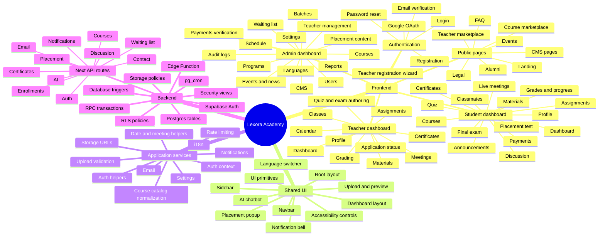

---

## 4. Repository Map

```text
src/
├── app/
│   ├── page.tsx                         # Landing page
│   ├── layout.tsx                       # Root providers, metadata, a11y init
│   ├── proxy.ts                         # Auth/role/rate-limit gate
│   ├── (dashboard)/layout.tsx           # Shared dashboard shell
│   ├── (dashboard)/student/              # Student dashboard routes
│   ├── (dashboard)/teacher/              # Teacher dashboard routes
│   ├── (dashboard)/admin/               # Admin dashboard routes
│   ├── api/                             # Server route handlers
│   ├── masuk/                            # Login
│   ├── daftar/                           # Registration
│   ├── lupa-password/                    # Password reset
│   ├── verifikasi-email/                 # Verification landing page
│   ├── project/                          # Public course marketplace
│   ├── guru/                             # Public teacher marketplace
│   ├── event/                            # Public event pages
│   ├── berita/                           # Legacy news redirect + detail
│   ├── alumni/                           # Alumni/batch public pages
│   ├── faq/, tentang/, kontak/            # Public information/CMS pages
│   └── legal/                            # Terms and privacy
├── components/
│   ├── landing/                          # Landing sections
│   ├── layout/                           # Navbar, sidebar, dashboard layout
│   ├── register/                         # Teacher wizard
│   ├── shared/                           # A11y, notifications, AI, uploads, etc.
│   └── ui/                               # Internal reusable primitives
├── lib/
│   ├── auth.ts, auth-context.tsx         # Auth operations and user state
│   ├── supabase-client.ts                # Browser client
│   ├── supabase-server.ts                # Server client + service-role client
│   ├── notifications.ts, email.ts       # Notification/email service helpers
│   ├── storage.ts, upload.ts             # Storage URL and upload utilities
│   ├── course-catalog.ts                 # Catalog tier/track normalization
│   ├── i18n/                             # en/id/zh translations
│   ├── rate-limit.ts                     # In-memory API rate limiter
│   └── utils.ts                          # Shared formatting and domain helpers
└── types/index.ts                        # Domain interfaces

supabase/
├── migrations/                           # Schema, RLS, functions, triggers, fixes
├── functions/ai-chat/                    # AI Edge Function
└── config.toml                           # Supabase local/project config
```

---

## 5. Route Map

### Public routes

| Route | Fungsi |
|---|---|
| `/` | Landing page dan CTA pendaftaran |
| `/project` | Marketplace program/kursus |
| `/program` | Redirect legacy ke `/project` |
| `/guru` | Daftar guru publik |
| `/guru/[id]` | Detail guru |
| `/event` | Daftar event + news yang ditampilkan pada area event |
| `/event/[slug]` | Detail event |
| `/berita` | Redirect legacy ke `/event` |
| `/berita/[slug]` | Detail news lama |
| `/faq` | FAQ dari CMS |
| `/tentang` | Konten tentang platform dari CMS |
| `/kontak` | Form contact message |
| `/alumni` | Daftar batch alumni |
| `/alumni/[id]` | Detail batch alumni, badge, dan certificate |
| `/legal/syarat-ketentuan` | Terms |
| `/legal/kebijakan-privasi` | Privacy policy |
| `/masuk` | Login password/Google |
| `/daftar` | Student signup atau teacher signup wizard |
| `/lupa-password` | Request/reset password |
| `/verifikasi-email` | Halaman setelah email verification |

### Student routes

| Route | Fungsi utama |
|---|---|
| `/student/dashboard` | Ringkasan kursus, tugas, nilai, jadwal, notif, placement |
| `/student/kursus` | Daftar enrollment dan marketplace kursus |
| `/student/kursus/[id]` | Detail kursus dan tab konten |
| `/student/kursus/[id]/materi` | Materi kursus |
| `/student/kursus/[id]/pertemuan` | Jadwal/pertemuan dan attendance |
| `/student/kursus/[id]/teman` | Classmate profiles |
| `/student/kursus/[id]/teman/[userId]` | Detail classmate |
| `/student/tugas/[id]` | Detail tugas, upload submission |
| `/student/kuis/[id]` | Mengerjakan quiz dan melihat hasil |
| `/student/courses/[id]/exam` | Final exam dengan timer dan review |
| `/student/kalender` | Kalender assignment/quiz/exam |
| `/student/nilai` | Agregasi nilai akademik |
| `/student/progress` | Progress materi, sesi, quiz, attendance |
| `/student/placement-test` | Pembelian, akses, dan pengerjaan placement |
| `/student/placement` | Riwayat/hasil placement versi dashboard |
| `/student/riwayat-placement` | Riwayat placement dan review jawaban |
| `/student/pembayaran` | Daftar invoice dan upload bukti pembayaran |
| `/student/sertifikat` | Daftar certificate |
| `/student/diskusi` | Diskusi per course |
| `/student/pengumuman` | Announcements |
| `/student/profil` | Profile, avatar, bahasa preferensi, badge |

### Teacher routes

| Route | Fungsi utama |
|---|---|
| `/teacher/dashboard` | Ringkasan kelas, student, nilai, submission, sesi |
| `/teacher/apply` | Status dan pengisian aplikasi teacher |
| `/teacher/kelas` | Daftar kelas yang diajar |
| `/teacher/kelas/[id]` | Detail kelas/batch/student |
| `/teacher/pertemuan` | CRUD live session dan attendance |
| `/teacher/materi` | CRUD materi dan upload file |
| `/teacher/penugasan` | CRUD assignment dan monitoring submission |
| `/teacher/penugasan/[id]/grading` | Grading submission |
| `/teacher/quiz` | CRUD quiz, exam, question, essay grading |
| `/teacher/nilai` | Rekap nilai student per kelas |
| `/teacher/kalender` | Kalender pengajaran |
| `/teacher/sertifikat` | Upload/kelola certificate kelas |
| `/teacher/profil` | Profile teacher, bahasa, program, keamanan |

### Admin routes

| Route | Fungsi utama |
|---|---|
| `/admin/dashboard` | KPI users, courses, enrollment, batch, payment, grades |
| `/admin/users` | CRUD user, role/status, reset/admin-created user |
| `/admin/teacher-management` | Review aplikasi dan kelola teacher aktif |
| `/admin/program` | CRUD program dan catalog details |
| `/admin/kursus` | CRUD course, teacher assignment, visibility/status |
| `/admin/batch` | Batch, teacher assignment, completion |
| `/admin/waiting-list` | Review waiting list |
| `/admin/verifikasi` | Review payment proof dan approve/reject |
| `/admin/placement` | CRUD placement test/questions |
| `/admin/bahasa` | CRUD language |
| `/admin/jadwal` | CRUD live session lintas course |
| `/admin/event` | CRUD events |
| `/admin/berita` | CRUD news |
| `/admin/cms` | Edit CMS content |
| `/admin/laporan` | Reports/statistics |
| `/admin/audit` | Audit log |
| `/admin/settings` | Branding, feature flags, AI, email, placement, storage |

---

## 6. Authentication & Authorization Workflow

```mermaid
flowchart TD
  Start([User membuka aplikasi]) --> Public{Public route?}
  Public -->|Ya| Page[Render public page]
  Public -->|Tidak, dashboard/API| Rate[Rate limit API jika endpoint API]
  Rate --> Session[Supabase SSR getUser dari cookie]
  Session --> Authenticated{Ada user?}
  Authenticated -->|Tidak| Login[/masuk?redirect=path]
  Authenticated -->|Ya| Profile[Ambil users.role + users.status]
  Profile --> Applicant{Student dengan teacher application pending/revision?}
  Applicant -->|Ya| Apply[/teacher/apply]
  Applicant -->|Tidak| RoleCheck{Role cocok dengan prefix route?}
  RoleCheck -->|Student ke teacher/admin| StudentDash[/student/dashboard]
  RoleCheck -->|Teacher ke student/admin| TeacherDash[/teacher/dashboard]
  RoleCheck -->|Admin ke student/teacher| AdminDash[/admin/dashboard]
  RoleCheck -->|Cocok| Continue[Render route]

  Login --> Password[signIn email/password]
  Login --> Google[signInWithGoogle]
  Password --> RoleRedirect[Redirect berdasarkan users.role]
  Google --> Callback[/api/auth/callback]
  Callback --> Exchange[exchangeCodeForSession]
  Exchange --> EnsureProfile[Pastikan public.users tersedia]
  EnsureProfile --> RoleRedirect
```

### Aturan role aktual

- Registrasi publik **selalu membuat `student`**, walaupun client mengirim role lain.
- Database trigger `users_guard_role_status` memaksa non-admin menjadi `student` + `active` saat insert.
- Teacher hanya menjadi teacher setelah admin menjalankan RPC `approve_teacher_application`.
- Admin adalah role yang dapat mengubah role/status user melalui UI/policy admin.
- `src/app/(dashboard)/layout.tsx` melakukan pengecekan tambahan untuk memastikan teacher memiliki row `teachers.status = active`.
- Ada `ProtectedRoute` component legacy, tetapi enforcement utama dilakukan oleh `src/proxy.ts` dan RLS.

---

## 7. Student Signup & Teacher Application Workflow

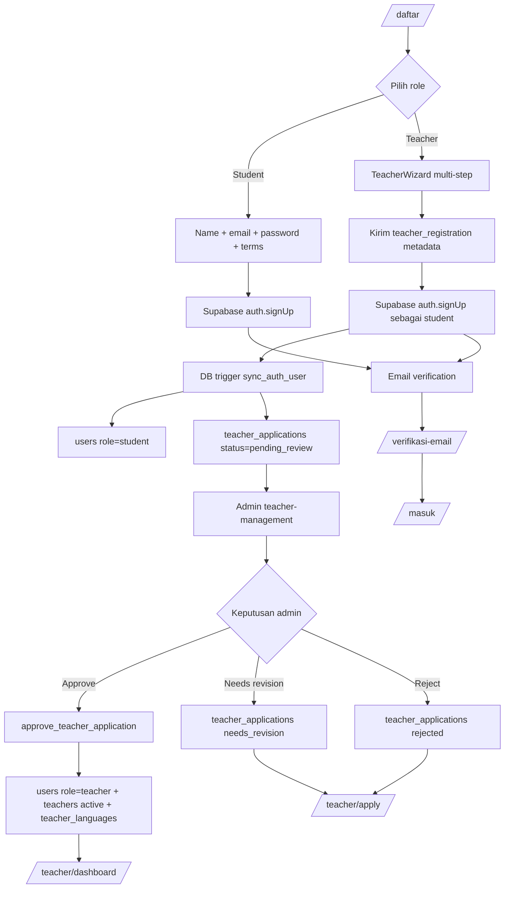

---

## 8. Course Discovery, Enrollment, Batch & Payment Workflow

```mermaid
flowchart TD
  Marketplace[/project atau /student/kursus/] --> Course[Student memilih course]
  Course --> Auth{Sudah login?}
  Auth -->|Tidak| Register[/daftar?next=...]
  Auth -->|Ya| EnrollAPI[POST /api/enrollments]
  Register --> Auth
  EnrollAPI --> CreateRPC[RPC create_course_enrollment]
  CreateRPC --> Existing{Enrollment existing?}
  Existing -->|Active/pending| ExistingResult[Kembalikan enrollment/payment lama\nidempotent]
  Existing -->|Tidak| Trial{is_try_class?}
  Trial -->|Ya| TrialBatch[find_or_create_batch_serialized]
  TrialBatch --> TrialActive[Enrollment active\nresolve waiting list lama]
  Trial -->|Tidak| Batch[Lock course + assign/create batch atomik]
  Batch --> Price{Course price > 0?}
  Price -->|Tidak| Active[Enrollment active]
  Price -->|Ya| Pending[Enrollment pending + payment pending]
  Pending --> StudentPayment[/student/pembayaran/]
  StudentPayment --> UploadProof[Upload proof ke storage]
  UploadProof --> AdminVerify[/admin/verifikasi/]
  AdminVerify --> Review{Admin review_payment}
  Review -->|Approved| Activate[Payment approved + enrollment active]
  Review -->|Rejected| Reject[Payment rejected + notification]
  Active --> Notify[Notify student, teacher, admin]
  Activate --> Notify
  TrialActive --> Notify
  Reject --> StudentPayment
  Notify --> Content[Student dapat akses konten aktif]
```

### Catatan penting

- Enrollment normal tidak dibuat langsung oleh client; flow utama memakai RPC transaction.
- Batch allocator memakai advisory lock pada versi corrective terbaru untuk mencegah race condition.
- Harga course dan placement dibaca dari server/database, bukan dipercaya dari browser.
- Course gratis langsung `active`; course berbayar dimulai sebagai `pending` sampai payment approved.
- Trial class pada migration corrective terbaru menjadi enrollment `active`, bukan hanya waiting list.
- Waiting list tetap digunakan ketika slot trial/course belum tersedia dan diproses admin lewat `/api/waiting-list/assign`.

---

## 9. Student Learning Workflow

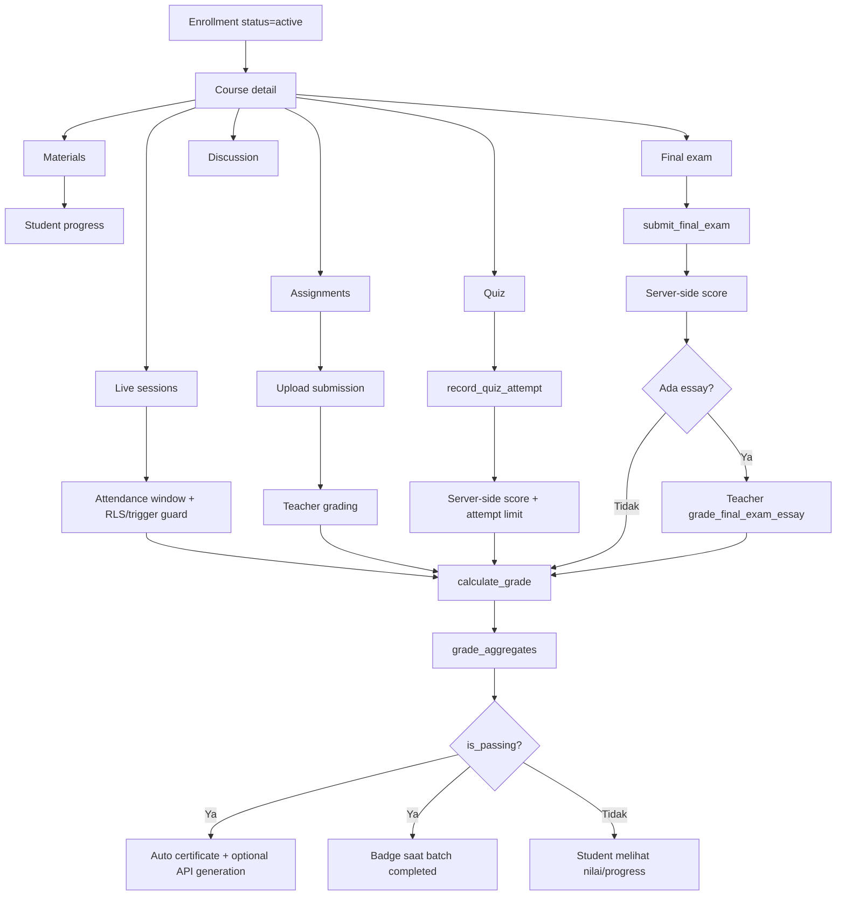

### Proteksi akademik di database

- `record_quiz_attempt` menghitung score dari `quiz_questions`; `p_score` dari client diabaikan.
- `submit_final_exam` menghitung score dari `exam_questions`; client tidak dapat mengatur score/passed.
- Student membaca question melalui view `quiz_questions_student` / `exam_questions_student` tanpa `correct_answer` pada jalur normal.
- Review jawaban dan correct answer diberikan melalui RPC yang memvalidasi pemilik attempt.
- Nilai essay divalidasi terhadap maksimum point question oleh RPC grading.
- Attendance dibatasi ke user sendiri, kelas aktif, sesi tidak dibatalkan, dan time window yang diizinkan.
- Submission guard mencegah student mengisi/mengubah grade, feedback, graded_by, dan status grading.

---

## 10. Final Exam → Certificate Workflow

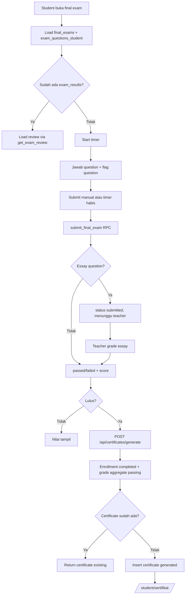

> Database juga memiliki trigger `auto_generate_certificate` ketika `grade_aggregates.is_passing` berubah menjadi true. API generation memiliki unique index per enrollment sebagai concurrency guard.

---

## 11. Teacher Operations Workflow

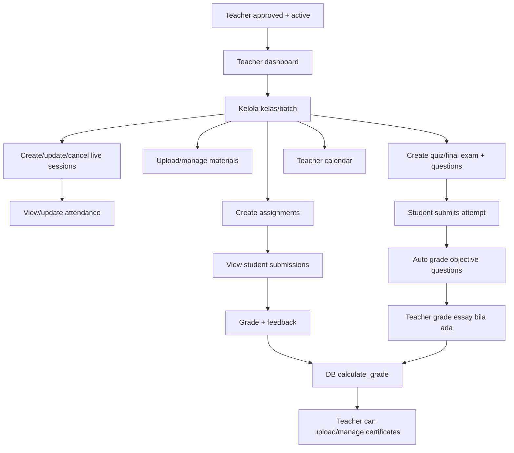

Teacher-scoped access ditentukan melalui relasi:

```text
users (role=teacher)
  └── teachers.user_id
        ├── teacher_languages
        ├── teacher_programs
        └── course_teachers
              └── courses
                    ├── batches
                    ├── live_sessions
                    ├── materials
                    ├── assignments
                    ├── quizzes / final_exams
                    └── enrollments / submissions / grades
```

---

## 12. Admin Operations Workflow

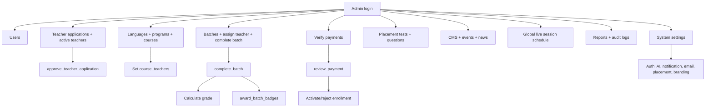

---

## 13. Placement Test Workflow

```mermaid
flowchart TD
  Popup[PlacementPromptPopup] --> PlacementPage[/student/placement-test]
  PlacementPage --> PaymentCheck{Ada payment approved\n< 7 hari?}
  PaymentCheck -->|Tidak| Purchase[POST /api/placement/purchase]
  Purchase --> Invoice[Payment purpose=placement]
  Invoice --> Verify[Admin review payment]
  Verify -->|Approved| Paid[Placement access aktif 7 hari]
  Verify -->|Rejected| PaymentPage[/student/pembayaran]
  PaymentCheck -->|Ya| Paid
  Paid --> LoadQuestions[Load placement_questions_student]
  LoadQuestions --> Submit[POST /api/placement]
  Submit --> Score[submit_placement_test RPC]
  Score --> Result[placement_results + provisional level + total questions]
  Result --> History[/student/riwayat-placement]
```

Scoring placement dilakukan di database dan pada migration terbaru level dipetakan ke:

- `0–50%` → `basic`
- `51–85%` → `advance`
- `>85%` → `expert`

---

## 14. Notification & Realtime Workflow

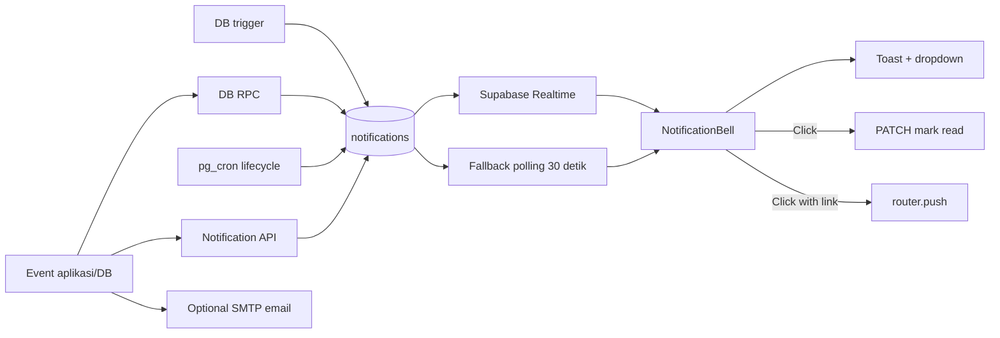

Sumber notifikasi yang ditemukan:

- Enrollment baru: student, teacher, admin.
- Payment approved/rejected.
- Teacher application approved.
- Assignment mendekati deadline.
- Live session mendatang.
- Batch akan mulai, sudah aktif, atau selesai.
- Link Zoom belum tersedia.
- Teacher profile/student profile belum lengkap.
- Certificate tersedia.
- Batch tertinggal dari target pertemuan.
- Notification template i18n melalui `template_key` + `params`.

---

## 15. AI Chatbot Workflow

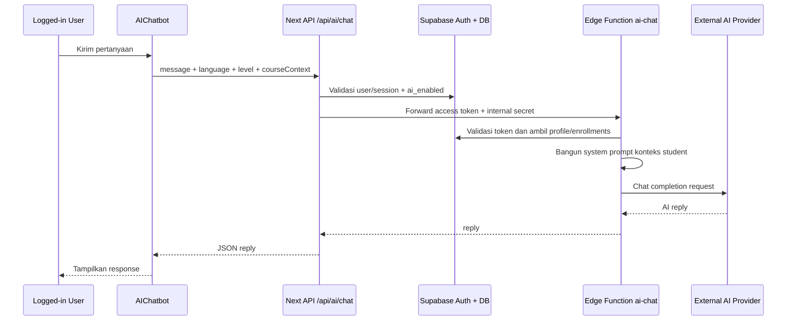

Feature flags yang terdeteksi:

- `ai_enabled`
- `ai_api_endpoint`
- `ai_api_key`
- `ai_model`
- `AI_CHAT_INTERNAL_SECRET`
- `OPENCODE_ZEN_API_URL`
- `OPENCODE_ZEN_API_KEY`

---

## 16. Data Model Mind Map

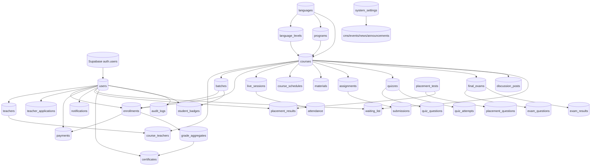

### Tabel inti dari baseline + migrations

**Identity & access**

- `users`
- `teachers`
- `teacher_applications`
- `teacher_languages`
- `teacher_programs`
- `system_settings`
- `audit_logs`
- `activity_log`

**Catalog**

- `languages`
- `language_levels`
- `programs`
- `courses`
- `course_teachers`
- `batches`
- `course_schedules`

**Learning**

- `enrollments`
- `live_sessions`
- `attendance`
- `materials`
- `assignments`
- `submissions`
- `quizzes`
- `quiz_questions`
- `quiz_attempts`
- `final_exams`
- `exam_questions`
- `exam_results`
- `grade_aggregates`

**Outcome & engagement**

- `certificates`
- `student_badges`
- `discussion_posts`
- `notifications`
- `announcements`

**Commerce & placement**

- `payments`
- `waiting_list`
- `placement_tests`
- `placement_questions`
- `placement_results`

**Public/content**

- `cms_content`
- `events`
- `news`
- `news_articles`
- `news_categories`
- `news_comments`
- `news_tags`
- `contact_messages`

**Security views**

- `quiz_questions_student`
- `quiz_questions_teacher`
- `exam_questions_student`
- `exam_questions_teacher`
- `placement_questions_student`
- `placement_questions_admin`
- `batchmate_profiles`
- `batchmate_certificates`

---

## 17. Database Automation Map

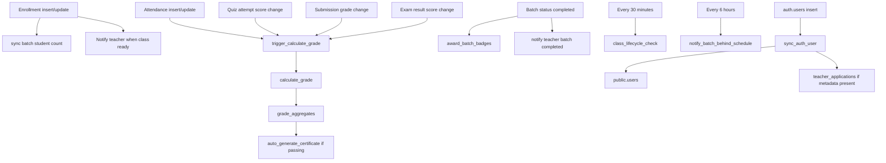

RPC penting yang ditemukan:

- `create_course_enrollment`
- `find_or_create_batch`
- `find_or_create_batch_serialized`
- `review_payment`
- `approve_teacher_application`
- `record_quiz_attempt`
- `submit_final_exam`
- `get_quiz_review`
- `get_exam_review`
- `grade_quiz_attempt_essay`
- `grade_final_exam_essay`
- `submit_placement_test`
- `complete_batch`
- `notify_course_teachers`
- `notify_admins_for_course`
- `get_batch_meeting_progress`

---

## 18. API Surface

| Method | Endpoint | Tujuan |
|---|---|---|
| `POST` | `/api/auth/login` | Server-side login helper |
| `POST` | `/api/auth/register` | Server-side registration helper; role dipaksa student |
| `GET` | `/api/auth/callback` | Exchange OAuth code dan redirect role |
| `GET` | `/api/courses` | Active marketplace courses + pagination/filter |
| `POST` | `/api/enrollments` | Create enrollment via RPC + notifications |
| `GET` | `/api/enrollments` | Ambil enrollment user |
| `POST` | `/api/claim-trial` | Claim trial class via enrollment RPC |
| `POST` | `/api/waiting-list/assign` | Admin assign waiting list ke batch/enrollment |
| `POST` | `/api/placement/purchase` | Buat payment placement |
| `POST` | `/api/placement` | Submit placement melalui server-side scoring |
| `POST` | `/api/certificates/generate` | Generate certificate jika enrollment lulus |
| `GET` | `/api/notifications` | Ambil notification user |
| `PATCH` | `/api/notifications` | Mark one/all as read |
| `GET` | `/api/notifications/count` | Unread count |
| `POST` | `/api/notifications/generate` | Generate reminder notification dinamis |
| `POST` | `/api/notifications/send` | Internal API-key notification sender |
| `GET` | `/api/diskusi` | Ambil discussion posts per course |
| `POST` | `/api/diskusi` | Buat discussion post |
| `POST` | `/api/email/send` | Kirim email dari user/admin dengan guard recipient |
| `POST` | `/api/email/teacher-notification` | Public signup notification ke admin; service-role server-only |
| `POST` | `/api/kontak` | Simpan contact message |
| `POST` | `/api/ai/chat` | Authenticated AI gateway ke Edge Function |

Semua API melewati rate limiter di `src/proxy.ts`; konfigurasi lebih ketat tersedia untuk login, register, enrollment, AI, dan email.

---

## 19. Security Boundary

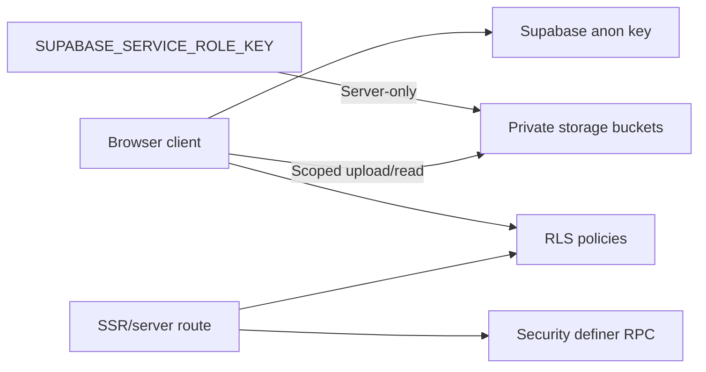

### Kontrol keamanan yang terlihat

- Session cookie dikelola `@supabase/ssr`.
- `src/proxy.ts` memvalidasi user sebelum dashboard.
- Role/status guard di database mencegah privilege escalation.
- RLS tersedia di seluruh tabel utama.
- Score quiz, exam, dan placement dihitung di server/database.
- Correct answer dipisahkan melalui security-barrier views.
- Payment status tidak boleh dimanipulasi student; review memakai RPC admin.
- Certificate dibuat idempotent dan memiliki unique index per enrollment.
- Upload sensitif memakai signed URL untuk preview admin.
- `SUPABASE_SERVICE_ROLE_KEY` hanya dipakai di server route teacher notification.
- API rate limiting memakai IP dan route.
- Header keamanan di `next.config.ts`: frame deny, nosniff, referrer policy, HSTS.
- Accessibility initialization mendukung theme, font size, line spacing, dyslexia, reduced motion, dan color-blind mode.

---

## 20. Temuan & Area yang Perlu Diverifikasi

Bagian ini bukan asumsi desain; semuanya muncul dari perbandingan source, types, dan migration yang terlihat.

### A. Potensi drift antara source dan schema

1. **Discussion contract sudah konsisten pada tabel data**: `src/app/(dashboard)/student/diskusi/page.tsx`, `src/app/(dashboard)/student/kursus/[id]/page.tsx`, dan `src/app/api/diskusi/route.ts` membaca/menulis `discussion_posts`. String `discussions` yang tersisa di page student hanya nama storage bucket untuk gambar discussion, bukan query tabel. Tidak ada perubahan schema/code yang diperlukan untuk mismatch ini.
2. Beberapa tipe lama di `src/types/index.ts` masih menggunakan nama/shape yang tidak sepenuhnya sama dengan schema terbaru, misalnya `UserRole` memiliki `'user'` sementara routing utama hanya mengenal `student`, `teacher`, dan `admin`.
3. `src/app/berita/page.tsx` dan `src/app/program/page.tsx` adalah redirect legacy, sementara fitur publik aktual memakai `/event` dan `/project`.
4. Migration berjalan secara corrective/additive. File terbaru seperti `20260811000000_corrective_contracts.sql` dan `20260812010000_placement_results_total_questions.sql` harus dianggap lebih authoritative daripada baseline lama.

### B. Infrastruktur

1. Rate limiter saat ini in-memory. Pada multi-instance/serverless deployment, counter tidak shared dan bukan pengganti Redis/edge rate limit.
2. `Strict-Transport-Security` dipasang global. Ini tepat untuk production HTTPS, tetapi dapat menyulitkan local development jika domain pernah diakses dengan HSTS.
3. Upload helper generik memakai `getPublicUrl`; bucket sensitif yang sudah diprivatisasi harus selalu memakai path/signed URL flow yang sesuai.
4. Email teacher notification memakai admin email statis di route. Lebih aman bila alamat tujuan berasal dari setting server atau environment variable.

### C. Maintainability

1. Banyak halaman dashboard langsung memanggil Supabase client. Ini memberi akses cepat, tetapi domain logic tersebar di page component dan sulit diuji secara unit.
2. Sebagian workflow sudah memakai RPC transaction yang baik, sementara sebagian operasi CRUD masih langsung dari browser dan bergantung pada RLS.
3. Ada dua lapisan notification: `template_key + params` terbaru dan `title/body` legacy. Renderer harus mempertahankan fallback kedua format.
4. Ada component dan tipe legacy yang masih dipertahankan untuk compatibility. Sebelum refactor besar, perlu audit usage agar tidak menghapus route/view yang masih dipakai.

---

## 21. Ringkasan Satu Halaman

```text
PUBLIC USER
  -> lihat katalog
  -> daftar/login
  -> Supabase Auth + public.users
  -> role redirect

STUDENT
  -> pilih course
  -> create_course_enrollment
  -> batch allocation
  -> free: active
  -> paid: payment pending
  -> admin approve
  -> active learning
  -> material + meeting + attendance + assignment + quiz + exam
  -> grade aggregate
  -> pass: certificate + badge

TEACHER
  -> apply sebagai student
  -> admin review
  -> approve_teacher_application
  -> teacher profile + course assignment
  -> manage class/content/assessment/grading

ADMIN
  -> manage user/teacher/catalog/batch/payment/content/settings
  -> approve payment/application
  -> complete batch
  -> reports/audit

AUTOMATION
  -> RLS menjaga data
  -> RPC menjaga transaksi dan scoring
  -> trigger menghitung grade/certificate/badge/notif
  -> pg_cron menjalankan lifecycle kelas
  -> realtime menampilkan notification
  -> Edge Function menghubungkan AI provider
```

---

## 22. Cara Membaca Diagram

- **GitHub**: file Markdown ini dapat menampilkan sebagian Mermaid secara otomatis.
- **VS Code**: gunakan extension Mermaid Markdown Preview.
- **Mermaid Live Editor**: copy satu blok `mermaid` untuk melihat diagram terpisah.
- **Notion/Miro/draw.io**: gunakan diagram sebagai blueprint untuk digambar ulang jika renderer Mermaid tidak tersedia.

Untuk checklist **setiap file**, baca juga [`CODEBASE-FILE-COVERAGE.md`](./CODEBASE-FILE-COVERAGE.md). File tersebut memetakan route, component, library, test, migration, Edge Function, hidden config, dan asset family satu per satu.

Dokumen ini bisa dijadikan dasar untuk membuat dokumentasi lanjutan per domain: `AUTH.md`, `STUDENT-FLOW.md`, `TEACHER-FLOW.md`, `ADMIN-FLOW.md`, atau `DATABASE-ERD.md`.
